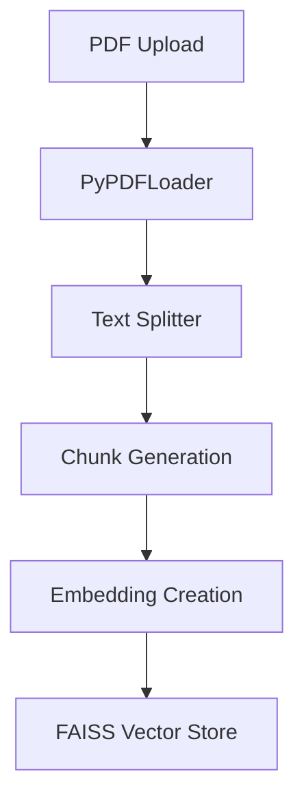
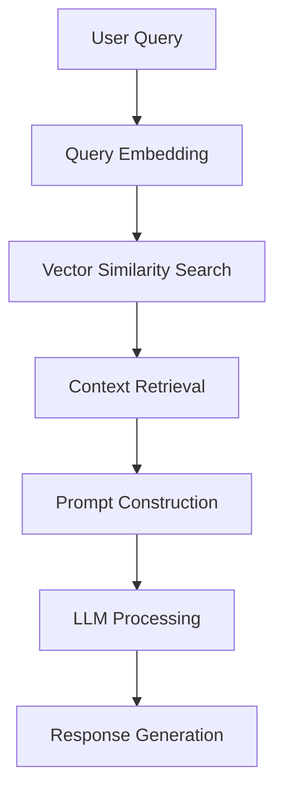

# Naive RAG with LangChain

A Retrieval-Augmented Generation (RAG) application built using the LangChain framework that allows users to upload a PDF document and query its content using state-of-the-art language models.

## Tech Stack

- **LangChain**: Core framework for LLM chains.
- **Streamlit**: Interactive UI for the application.
- **LLM Providers**:
  - **OpenAI** (GPT-4o-mini)
  - **DeepSeek** (via Ollama with DeepSeek-R1)
  - **Groq** (Cloud API using models like `mixtral-8x7b-32768`, `llama-3.3-70b-versatile`, `deepseek-r1-distill-llama-70b`, `gemma2-9b-it`)
  - **Ollama** (Local model execution)
- **Vector Store**: FAISS for fast similarity search.
- **Document Processing**:
  - **PyPDFLoader (via PyPDF2)**: For loading PDF documents.
  - **RecursiveCharacterTextSplitter**: For splitting text into manageable chunks.
- **Embeddings**:
  - **HuggingFaceEmbeddings** (using Sentence Transformers – Default: `sentence-transformers/all-MiniLM-L6-v2`)
  - **OpenAIEmbeddings**: Alternative for high-quality cloud-based embeddings.

## Features

- **PDF Document Processing**: Upload a PDF and automatically process its pages.
- **Efficient Chunking and Embedding**: Converts documents into chunks and stores them in FAISS.
- **Multi-Provider LLM Support**: Select from OpenAI, DeepSeek, Groq, or Ollama.
- **Customizable Settings**: Adjust advanced options such as temperature and top_p.
- **Real-Time Response Streaming**: View the generated answer and (if supported) the detailed thinking process.
- **Interactive UI**: Use the sidebar to configure LLM and embedding providers, model parameters, and more.

## Technical Architecture

### 1. Document Processing Pipeline


### 2. Query Processing Flow


## Setup

1. **Clone the Repository**
   ```bash
   git clone <repository_url>
   cd naive-rag/langchain-rag
   ```

2. **Install Dependencies**
   ```bash
   pip install -r requirements.txt
   ```

3. **Configure Environment Variables**

   Create a `.env` file in the project root with the following content:
   ```env
   OPENAI_API_KEY=your-openai-api-key
   GROQ_API_KEY=your-groq-api-key
   GROQ_MODELS=mixtral-8x7b-32768,llama2-70b-4096,deepseek-r1-distill-llama-70b,gemma-7b-it
   SENTENCE_TRANSFORMER_MODEL=sentence-transformers/all-MiniLM-L6-v2
   OPENAI_EMBEDDING_MODEL=text-embedding-3-small
   ```

4. **For Local Models (Ollama/DeepSeek)**
   - Install Ollama:
     ```bash
     curl https://ollama.ai/install.sh | sh
     ```
   - Start the Ollama server:
     ```bash
     ollama serve
     ```
   - Pull the required model:
     ```bash
     ollama pull deepseek-r1:latest
     ```

## Usage

### Running the Web Application

1. **Launch the App**
   ```bash
   streamlit run app.py
   ```
2. **Open the Browser**
   Visit [http://localhost:8501](http://localhost:8501).

3. **Configure via the Sidebar**
   - **LLM Provider**: Choose from OpenAI, Ollama, DeepSeek, or Groq.
   - **Model Variant & Advanced Settings**: Configure options (e.g., for DeepSeek adjust temperature and top_p).
   - **Embedding Provider**: Select between Sentence Transformer and OpenAI embeddings.

4. **Interact**
   - Upload a PDF document.
   - Ask questions about the PDF content.
   - Optionally, view the retrieved context and in-depth "thinking" process (if the chosen model supports it).

### Notebook Tutorial (Colab/Jupyter)

The repository includes a Colab notebook: [`naive_rag_tutorial_using_groq.ipynb`](naive-rag/langchain-rag/naive_rag_tutorial_using_groq.ipynb) which demonstrates:

- Loading a PDF from a URL.
- Splitting text into chunks and creating embeddings.
- Building a FAISS vector store for efficient context retrieval.
- Initializing and using Groq's LLM (with the `deepseek-r1-distill-llama-70b` model) for question answering.

**Steps in the Notebook:**
- **Install Required Packages:** Automatically installs dependencies.
- **Load and Process a PDF:** Uses a sample PDF (e.g., [Attention Is All You Need](https://arxiv.org/pdf/1706.03762.pdf)).
- **Build the Vector Store:** Splits the document and creates embeddings.
- **Initialize Groq LLM:** Sets up the Groq model.
- **Query the System:** Ask questions and observe detailed responses with the thinking process highlighted.

## LLM Provider Details

### OpenAI
- **Model:** GPT-4o-mini
- **Features:** Accurate, streaming responses.
- **Setup:** Requires an `OPENAI_API_KEY`.

### DeepSeek (via Ollama)
- **Model:** `deepseek-r1:latest` (options such as `deepseek-r1:instruct` available)
- **Features:** Provides a detailed "thinking" process visualization.
- **Configuration:** Advanced settings for parameters like temperature and top_p are available.

### Groq
- **Models:** 
  - `mixtral-8x7b-32768`
  - `llama2-70b-4096`
  - `deepseek-r1-distill-llama-70b`
  - `gemma-7b-it`
- **Features:** Cloud-based, high-performance inference.
- **Setup:** Requires a valid `GROQ_API_KEY`.

### Ollama
- **Usage:** For local model execution.
- **Features:** Runs locally (no API key required); ideal for privacy-focused deployment.
- **Note:** Uses the DeepSeek model (`deepseek-r1:latest`) for local inference.

## Embedding Options

### Sentence Transformers (Default)
- **Model:** `sentence-transformers/all-MiniLM-L6-v2` (configurable via `SENTENCE_TRANSFORMER_MODEL`)
- **Execution:** Runs locally using HuggingFaceEmbeddings.

### OpenAI Embeddings
- **Model:** `text-embedding-3-small`
- **Usage:** Requires `OPENAI_API_KEY`.

## Implementation Details

- **Document Chunking:** Uses `RecursiveCharacterTextSplitter` with a chunk size of 1000 characters and an overlap of 200.
- **Vector Store:** Built with FAISS to enable efficient similarity searches.
- **Caching:** Utilizes Streamlit caching (`@st.cache_resource`, `@st.cache_data`) for improved performance.
- **Error Handling:** Comprehensive error management is integrated throughout the application.
- **Streaming Response:** Answers are streamed in real time for a smoother user experience.

## Production Considerations

- **Scaling:**
  - Consider managed vector stores (e.g., Pinecone, Weaviate) for very large datasets.
  - Use sharding and cloud storage strategies for vector data.
- **Security:**
  - Maintain API key confidentiality.
  - Implement input validation, rate limiting, and access control.
- **Monitoring:**
  - Set up real-time logging and performance tracking.
  - Monitor usage and cost.

## Future Work

- Explore advanced RAG strategies including agent-based retrieval.
- Integrate additional parsing libraries for complex PDF files (images, tables).
- Expand support to managed vector stores like Pinecone or Weaviate.

## Contributing

Contributions are more than welcome! Please submit issues or pull requests to help improve this project.

## License

This project is licensed under the MIT License. See the [LICENSE](LICENSE) file for details.

