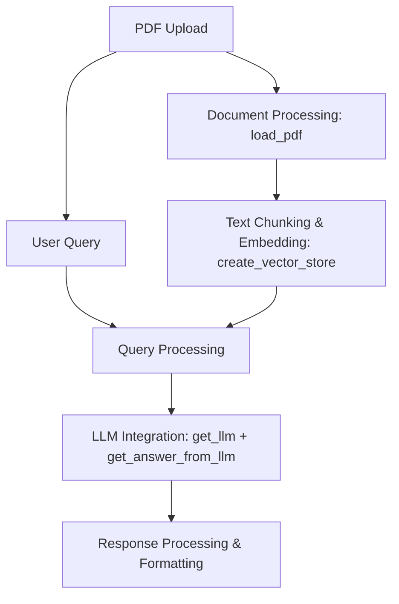

# Technical Implementation Guide 🔧

This document provides a detailed technical overview of the PDF Q&A RAG application, explaining the role of each component, their interactions, and the overall system architecture.

## System Architecture

### High-Level Overview



## Core Components

### 1. Document Processing Pipeline

#### PDF Loader (`load_pdf`)
```python
@st.cache_data
def load_pdf(uploaded_file) -> List[Document]:
    # Uses a temporary file to securely write the PDF content.
    # Loads the PDF with PyPDFLoader and ensures temporary cleanup.
```
- **Purpose**: Accepts PDF uploads, writes to a temporary file, invokes `PyPDFLoader` for parsing, and returns a list of `Document` objects.
- **Caching**: Utilizes Streamlit's `@st.cache_data` for efficient reuse of processed PDFs.
- **Error Handling**: Ensures cleanup of temporary files even in error conditions.

#### Text Splitter
```python
text_splitter = RecursiveCharacterTextSplitter(
    chunk_size=1000,
    chunk_overlap=200,
    length_function=len,
    is_separator_regex=False,
)
```
- **Purpose**: Splits documents into manageable chunks to preserve context.
- **Configuration**:
  - **chunk_size**: 1000 characters
  - **chunk_overlap**: 200 characters (to maintain context between chunks)
  - **is_separator_regex**: Set to `False` so that the splitter uses fixed boundaries rather than regex rules

### 2. Embedding System

#### Embedding Provider Factory (`get_embeddings`)
```python
@st.cache_resource
def get_embeddings(provider: str = "sentence_transformer"):
    # For "sentence_transformer", uses HuggingFaceEmbeddings with a configurable model name.
    # For "openai", uses OpenAIEmbeddings and requires the OPENAI_API_KEY.
```
- **Purpose**: Initializes and caches embedding models.
- **Supported Providers**:
  1. **Sentence Transformers (Default)**: Uses `HuggingFaceEmbeddings` with a configurable model (default: `sentence-transformers/all-MiniLM-L6-v2`).
  2. **OpenAI**: Uses `OpenAIEmbeddings` with model defined in `OPENAI_EMBEDDING_MODEL` (default: `text-embedding-3-small`).

### 3. Vector Store Management

#### Vector Store Creation (`create_vector_store`)
```python
@st.cache_resource
def create_vector_store(_documents: List[Document], embedding_provider: str = "sentence_transformer") -> FAISS:
    # Splits the documents using RecursiveCharacterTextSplitter,
    # then initializes embeddings and creates a FAISS index from the document chunks.
```
- **Purpose**: Generates document chunks, creates embeddings, and builds a FAISS index for similarity search.
- **Process Flow**:
  1. **Document Chunking**: Uses the text splitter to divide the document.
  2. **Embedding Generation**: Calls `get_embeddings` based on the selected provider.
  3. **Index Creation**: Uses `FAISS.from_documents` to construct the vector store.

### 4. LLM Integration

#### LLM Provider Factory (`get_llm`)
```python
@st.cache_resource
def get_llm(provider: str, model: Optional[str] = None, temperature: Optional[float] = None, top_p: Optional[float] = None):
    # Determines the LLM based on the provider:
    # - OpenAI: ChatOpenAI with model_name "gpt-4o-mini".
    # - Ollama: OllamaLLM using model "deepseek-r1:latest".
    # - DeepSeek: OllamaLLM with parameters from session_state and additional model_kwargs.
    # - Groq: ChatGroq expecting a valid GROQ_API_KEY.
```
- **Providers**:
  1. **OpenAI**: Uses `ChatOpenAI` with `gpt-4o-mini`, temperature 0, and streaming enabled.
  2. **Ollama**: Uses `OllamaLLM` with model `"deepseek-r1:latest"`, temperature `0.0`, and a local base URL.
  3. **DeepSeek**: Uses `OllamaLLM` with user-configurable parameters (model variant, temperature, top_p) and includes a stop token (`["<|end|>"]`) along with additional `model_kwargs`.
  4. **Groq**: Uses `ChatGroq` with streaming enabled; requires `GROQ_API_KEY` and takes model/temperature settings from session state.

#### Query and Response Pipeline

- **Query Processing**:
  1. **Similarity Search**: Retrieves relevant document chunks using `vector_store.similarity_search(query, k=4)`.
  2. **Context Assembly**: Combines the retrieved documents into a single context string.
- **Prompt Construction & Answer Generation** (inside `get_answer_from_llm`):
  ```python
   prompt = f"""Use the following context to answer the question. Be clear and concise.

  Context:
  {context}

  Question: {question}

  Answer: """
  ```
  - Feeds the prompt to the chosen LLM.
  - **Response Processing**: For non-OpenAI responses, checks for `<think>` tags to separate the model's thinking process from the final answer.
    - If a `<think>` block is detected, the thinking process is previewed via an expander and the answer is extracted following the `"Answer:"` marker.
    - If absent, the full response is used as the answer.

### 5. State and Cache Management

#### Session State
- **Purpose**: Maintains configuration and preferences during a user session.
- **Managed States**:
  - `st.session_state["LLM_PROVIDER"]`
  - `st.session_state["DEEPSEEK_MODEL"]`
  - `st.session_state["DEEPSEEK_TEMP"]`
  - `st.session_state["DEEPSEEK_TOP_P"]`
  - `st.session_state["GROQ_MODEL"]`
  - `st.session_state["GROQ_TEMP"]`
  - `st.session_state["EMBEDDING_PROVIDER"]`

#### Caching Strategies
- **@st.cache_data**: For data processing (e.g., PDF loading).
- **@st.cache_resource**: For model instances, embedding creation, and vector store creation—enhancing performance by preventing redundant computation.

### 6. UI and User Interaction

#### Styling and Layout
- **Custom CSS**: Defined within Streamlit markdown to style components.
  ```css
  .section-header {
      font-weight: 600;
      margin-bottom: 8px;
      color: #333;
  }
  .thinking-text {
      color: #666666;
      font-style: italic;
      background-color: #f5f5f5;
      padding: 15px;
      border-radius: 5px;
      margin-bottom: 20px;
      border-left: 4px solid #9e9e9e;
  }
  .answer-text {
      color: #1e88e5;
      background-color: #f8f9fa;
      padding: 15px;
      border-radius: 5px;
      border-left: 4px solid #1e88e5;
      margin-bottom: 10px;
  }
  ```
- **Configuration Sidebar**: Allows users to select:
  - The LLM provider (OpenAI, Ollama, DeepSeek, or Groq)
  - Embedding provider (Sentence Transformer or OpenAI)
  - Advanced parameters such as model variant, temperature, and top_p for providers like DeepSeek and Groq.

#### Interaction Flow
- **File Upload**: Users upload a PDF which is processed and converted into document chunks.
- **Query Submission**: Users enter a query about the document.
- **Response Streaming**: The system streams the LLM-generated response, optionally displaying the model's "thinking process" when available.

## Error Handling and Logging

- **Error Layers**:
  1. **PDF Processing**: Wrapped in try/finally blocks to ensure cleanup.
  2. **LLM Initialization and Invocation**: try/except blocks capture and log errors.
- **Logging**: Extensive logging is employed to track:
  - PDF upload and loading steps.
  - Vector store creation progress.
  - LLM initialization and prompt execution.
  - Response processing errors.

## Performance Optimizations

1. **Caching**: Leveraging `@st.cache_resource` and `@st.cache_data` to minimize recomputation.
2. **Resource Management**: Efficient temporary file handling and model instance reuse.
3. **Streaming**: Real-time response output for enhanced user experience.

## Development Guidelines

### Adding or Modifying Providers
1. Update the `get_llm` function with new provider logic.
2. Add corresponding configuration options in the sidebar.
3. Ensure environment variables are updated as needed.

### Customizing Embeddings
1. Modify `get_embeddings` to support new embedding models.
2. Adjust the vector store creation process if required.

### Extending the Query Pipeline
1. Modify the prompt construction in `get_answer_from_llm`.
2. Enhance response processing to better handle different output formats.

## Future Enhancements

- **Advanced Retrieval**: Integration with distributed or managed vector databases.
- **Multi-Document Support**: Handling multiple PDF uploads and cross-document context.
- **Enhanced UI**: Additional visualizations for the model's reasoning process.
- **Improved Error Recovery**: More robust handling for model timeouts or API rate limits.

## Security Considerations

1. **API Key Management**
   - Environment variables
   - Secure storage
   - Access control

2. **File Processing**
   - Temporary file handling
   - Input validation
   - Resource cleanup

3. **User Input**
   - Query sanitization
   - Response validation
   - Error boundaries 